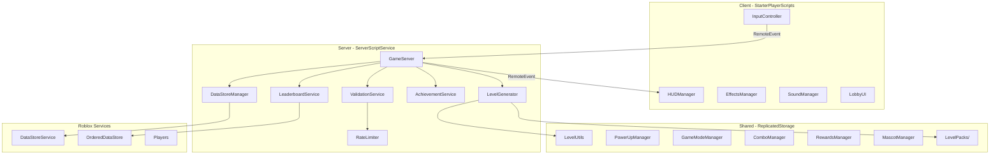
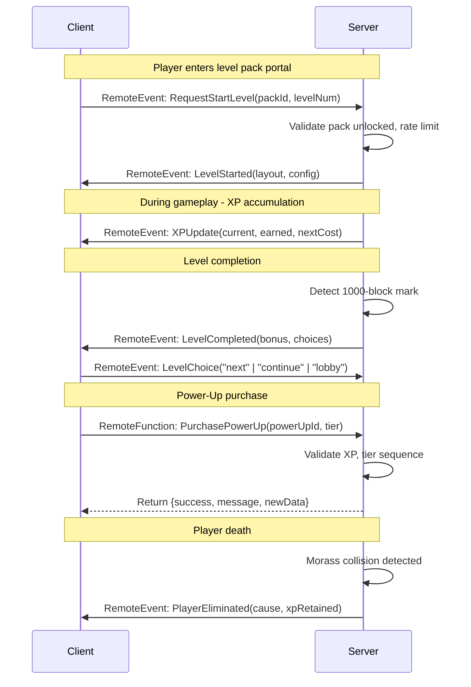

# Design Document: Pixel Run Obby

## Overview

Pixel Run Obby is a Roblox near-endless running game built using the Rojo external development workflow. Players run through themed 10-level packs on conveyor-belt obstacle courses, earning XP to purchase persistent power-ups. The game follows a strict client-server architecture where the server is authoritative over game state, scoring, and progression, while the client handles rendering, effects, and input.

The system is designed for weekly content expansion through a plugin-style level pack architecture where new packs are added as standalone module files requiring zero changes to core game systems.

### Key Design Decisions

1. **Rojo + Luau**: External development with full Git version control; Luau for type-safe scripting
2. **Server-authoritative**: All game state, scoring, and purchases validated server-side to prevent exploitation
3. **DataStoreService with in-memory cache**: Player data loaded once on join, cached in memory, flushed periodically and on key events
4. **Deterministic level generation**: Seeded random generation from pack config + level number ensures identical layouts every run
5. **Module-per-pack extensibility**: Each level pack is a self-contained ModuleScript with a standardized schema, auto-discovered at server start

## Architecture

### High-Level System Diagram



### Project File System Structure

```
PixelRun/
├── default.project.json
├── src/
│   ├── server/
│   │   ├── GameServer.server.luau
│   │   ├── LevelGenerator.luau
│   │   ├── DataStoreManager.luau
│   │   ├── LeaderboardService.luau
│   │   ├── AchievementService.luau
│   │   ├── ValidationService.luau
│   │   └── RateLimiter.luau
│   ├── client/
│   │   ├── InputController.client.luau
│   │   ├── HUDManager.luau
│   │   ├── EffectsManager.luau
│   │   ├── SoundManager.luau
│   │   └── LobbyUI.luau
│   └── shared/
│       ├── LevelUtils.luau
│       ├── PowerUpManager.luau
│       ├── GameModeManager.luau
│       ├── ComboManager.luau
│       ├── RewardsManager.luau
│       ├── MascotManager.luau
│       └── LevelPacks/
│           ├── TetrisPack.luau
│           └── ... (future packs)
└── tests/
    ├── LevelUtils.spec.luau
    ├── PowerUpManager.spec.luau
    ├── GameModeManager.spec.luau
    ├── ComboManager.spec.luau
    ├── RewardsManager.spec.luau
    └── LevelGenerator.spec.luau
```

### Rojo Project Mapping (default.project.json)

```json
{
  "name": "PixelRunObby",
  "tree": {
    "$className": "DataModel",
    "ServerScriptService": {
      "$className": "ServerScriptService",
      "$path": "src/server"
    },
    "StarterPlayer": {
      "$className": "StarterPlayer",
      "StarterPlayerScripts": {
        "$className": "StarterPlayerScripts",
        "$path": "src/client"
      }
    },
    "ReplicatedStorage": {
      "$className": "ReplicatedStorage",
      "$path": "src/shared"
    }
  }
}
```

This mapping ensures that dropping a new `.luau` file into `src/shared/LevelPacks/` automatically includes it in the build without modifying `default.project.json` (satisfying Requirement 1.6).

## Components and Interfaces

### Server Components

#### GameServer

The central orchestrator that initializes all server systems and manages the game loop.

```luau
-- GameServer.server.luau
type GameServer = {
    init: () -> (),
    onPlayerJoin: (player: Player) -> (),
    onPlayerLeave: (player: Player) -> (),
    startLevel: (player: Player, packId: string, levelNum: number) -> (),
    completeLevel: (player: Player) -> (),
    eliminatePlayer: (player: Player, cause: string) -> (),
}
```

#### LevelGenerator

Produces deterministic level layouts from pack configuration and level number.

```luau
-- LevelGenerator.luau
type LevelConfig = {
    width: number,           -- Always 10
    length: number,          -- Always 1000
    seed: number,            -- Derived from packId + levelNum
    obstacleDensity: number, -- Obstacles per block (1/50 to 1/10)
    obstacleTypes: {ObstacleType},
    maxHeight: number,
    gapWidth: number,
    voidLength: number,
    hasTouchKill: boolean,
}

type LevelLayout = {
    obstacles: {Obstacle},
    conveyorSpeed: number,
    morassVisual: string,
}

type LevelGenerator = {
    generateLevel: (packConfig: LevelPackConfig, levelNum: number) -> LevelLayout,
    buildLevel: (layout: LevelLayout) -> Model,
    validatePackSchema: (config: any) -> (boolean, string?),
}
```

#### DataStoreManager

Handles persistence with in-memory caching, periodic saves, and retry logic.

```luau
-- DataStoreManager.luau
type PlayerData = {
    xp: number,
    powerUps: {[string]: number},      -- PowerUp name -> tier (0 = not purchased)
    levelCompletions: {[string]: {number}}, -- PackId -> {completed level numbers}
    achievements: {string},            -- List of achievement IDs
    version: number,                   -- Schema version for migrations
}

type DataStoreManager = {
    loadPlayerData: (userId: number) -> (PlayerData?, string?),
    savePlayerData: (userId: number, data: PlayerData) -> (boolean, string?),
    getCachedData: (userId: number) -> PlayerData?,
    startAutoSave: () -> (),
    flushAll: () -> (),
}
```

#### LeaderboardService

Manages OrderedDataStore for global rankings.

```luau
-- LeaderboardService.luau
type LeaderboardEntry = {
    userId: number,
    displayName: string,
    value: number,
}

type LeaderboardService = {
    updateXPScore: (userId: number, totalXP: number) -> (),
    updateLevelScore: (userId: number, highestLevel: number) -> (),
    getTopXP: (count: number) -> {LeaderboardEntry},
    getTopLevel: (count: number) -> {LeaderboardEntry},
    getPlayerRank: (userId: number, board: string) -> (number?, number?),
}
```

#### ValidationService

Server-side validation for all state-changing requests.

```luau
-- ValidationService.luau
type ValidationService = {
    validatePurchase: (player: Player, powerUpId: string, tier: number) -> (boolean, string?),
    validateLevelCompletion: (player: Player, packId: string, levelNum: number) -> (boolean, string?),
    validateXPClaim: (player: Player, amount: number) -> (boolean, string?),
    isPackUnlocked: (playerData: PlayerData, packId: string) -> boolean,
}
```

#### RateLimiter

Enforces per-player remote call rate limits.

```luau
-- RateLimiter.luau
type RateLimiter = {
    check: (userId: number) -> boolean,  -- Returns true if under limit
    reset: (userId: number) -> (),
    MAX_CALLS_PER_SECOND: number,        -- 30
}
```

### Client Components

#### InputController

Handles player input and forwards validated actions to the server.

```luau
-- InputController.client.luau
type InputController = {
    init: () -> (),
    bindJump: () -> (),
    bindMovement: () -> (),
    onPurchaseRequest: (powerUpId: string, tier: number) -> (),
    onLevelChoice: (choice: "continue" | "next" | "lobby") -> (),
}
```

#### HUDManager

Manages all UI elements displayed during gameplay.

```luau
-- HUDManager.luau
type HUDManager = {
    updateXP: (current: number, earned: number, nextCost: number) -> (),
    showAchievement: (name: string, icon: string, duration: number) -> (),
    showLeaderboard: (entries: {LeaderboardEntry}, playerRank: number) -> (),
    showLevelChoice: () -> (),
    showError: (message: string) -> (),
}
```

#### EffectsManager

Particle systems and floating text for visual feedback.

```luau
-- EffectsManager.luau
type EffectsManager = {
    playLevelComplete: (position: Vector3) -> (),
    playXPGain: (amount: number, position: Vector3) -> (),
    playDeath: (position: Vector3) -> (),
    playAchievement: (name: string, duration: number) -> (),
}
```

#### SoundManager

Dynamic music and sound effects with crossfading.

```luau
-- SoundManager.luau
type SoundManager = {
    playPackMusic: (packTheme: string) -> (),
    playLobbyMusic: () -> (),
    crossfade: (toTrack: string, duration: number) -> (),
    playSFX: (effect: string) -> (),
}
```

### Shared Modules

#### LevelUtils

Pure utility functions for level calculations usable by both client and server.

```luau
-- LevelUtils.luau
type LevelUtils = {
    calculateXP: (blocksRun: number, packNumber: number) -> number,
    calculateCompletionBonus: () -> number,
    getObstacleDensity: (levelNum: number) -> number,
    getLevelSeed: (packId: string, levelNum: number) -> number,
    getDifficultyConfig: (levelNum: number) -> DifficultyConfig,
}
```

#### PowerUpManager

Defines power-up costs, effects, and validation logic.

```luau
-- PowerUpManager.luau
type PowerUpDefinition = {
    id: string,
    name: string,
    maxTier: number,
    costs: {number},          -- Cost per tier
    multipliers: {number},    -- Effect multiplier per tier
}

type PowerUpManager = {
    getDefinitions: () -> {PowerUpDefinition},
    getCost: (powerUpId: string, tier: number) -> number?,
    getMultiplier: (powerUpId: string, tier: number) -> number?,
    canPurchase: (playerData: PlayerData, powerUpId: string, tier: number) -> (boolean, string?),
    applyPurchase: (playerData: PlayerData, powerUpId: string, tier: number) -> PlayerData,
}
```

#### LevelPack Schema

Each level pack module exports a table conforming to this schema:

```luau
-- LevelPacks/TetrisPack.luau (example)
type ObstacleDefinition = {
    shape: string,
    orientations: {number},    -- Degrees: {0, 90, 180, 270}
    color: Color3,
    maxHeight: number,
    isTouchKill: boolean,
}

type LevelDifficulty = {
    obstacleDensity: number,   -- Obstacles per block
    maxHeight: number,
    gapWidth: number,
    voidLength: number,
    hasTouchKill: boolean,
    requiredPowerUps: {string}?,
}

type LevelPackConfig = {
    name: string,
    displayOrder: number,
    themeId: string,
    obstacleTypes: {ObstacleDefinition},
    difficulty: {[number]: LevelDifficulty},  -- Level 1-10
    morassVisual: string,
    achievementName: string,
    musicTrack: string,
    prerequisitePack: string?,  -- nil for first pack
}
```

### Communication Protocol (RemoteEvents/RemoteFunctions)



## Data Models

### Player Profile (Persisted via DataStoreService)

```luau
type PlayerProfile = {
    version: number,               -- Schema version (currently 1)
    xp: number,                    -- Total accumulated XP
    powerUps: {
        higherJump: number,        -- 0-3 (tier)
        doubleJump: number,        -- 0-1 (boolean as tier)
        fasterSpeed: number,       -- 0-3 (tier)
    },
    completions: {
        [string]: {number},        -- packId -> list of completed level numbers
    },
    achievements: {string},        -- List of earned achievement IDs
    highestLevel: number,          -- Overall highest level number (for leaderboard)
    totalBlocksRun: number,        -- Lifetime stat
}
```

**Storage Key**: `"player_" .. tostring(userId)`

### Level Pack Registry (In-Memory, Server)

```luau
type PackRegistry = {
    packs: {[string]: LevelPackConfig},   -- packId -> config
    orderedPacks: {string},                -- Pack IDs sorted by displayOrder
    loadErrors: {[string]: string},        -- Failed module -> error message
}
```

### Leaderboard Data (OrderedDataStore)

Two separate OrderedDataStores:
- `"Leaderboard_XP"` — keyed by userId, value = total XP
- `"Leaderboard_Level"` — keyed by userId, value = highest level number (pack * 10 + level)

### Rate Limiter State (In-Memory, Server)

```luau
type RateLimitState = {
    [number]: {           -- userId
        count: number,    -- Calls this second
        lastReset: number -- tick() of last reset
    }
}
```

### Power-Up Definitions (Static Config)

| Power-Up | Tier 1 | Tier 2 | Tier 3 | Cost T1 | Cost T2 | Cost T3 |
|----------|--------|--------|--------|---------|---------|---------|
| Higher Jump | 1.25x | 1.5x | 2.0x | 2000 XP | 5000 XP | 12000 XP |
| Double Jump | Enabled | — | — | 8000 XP | — | — |
| Faster Speed | 1.25x | 1.5x | 2.0x | 2000 XP | 5000 XP | 12000 XP |

### XP Calculation Model

```
xp_per_block = 1 * pack_multiplier
pack_multiplier = pack_display_order  (pack 1 = 1x, pack 2 = 2x, etc.)
level_completion_bonus = 500
total_run_xp = (blocks_traveled * xp_per_block) + (levels_completed * 500)
```

XP is retained even on elimination — the player keeps all XP earned up to the point of death.


## Correctness Properties

*A property is a characteristic or behavior that should hold true across all valid executions of a system — essentially, a formal statement about what the system should do. Properties serve as the bridge between human-readable specifications and machine-verifiable correctness guarantees.*

### Property 1: Pack Unlock Sequential Logic

*For any* player profile and pack configuration, a Level_Pack N (where N > 1) should be reported as unlocked if and only if the player has completed all 10 levels of pack N-1. Pack 1 (with no prerequisitePack) should always be unlocked.

**Validates: Requirements 2.6**

### Property 2: Obstacle Density Within Bounds

*For any* valid level number (1–10) and Level_Pack configuration, the number of obstacles generated in a 1000-block level should fall within the density bounds defined for that level number — between `1000 / 50 = 20` obstacles (level 1) and `1000 / 10 = 100` obstacles (level 10), scaling linearly.

**Validates: Requirements 3.2**

### Property 3: Obstacle Types Restricted by Level Tier

*For any* generated level within a pack, the obstacle types present should only include those permitted for that level's difficulty tier: levels 1–3 contain only jump-over obstacles, levels 4–6 add holes/gaps, levels 7–9 add void sections, and level 10 adds touch-and-die objects.

**Validates: Requirements 3.4**

### Property 4: Deterministic Level Generation

*For any* packId and level number, calling the level generator multiple times with the same inputs should produce an identical obstacle layout (same positions, types, and orientations).

**Validates: Requirements 3.5, 3.7**

### Property 5: XP Retention on Elimination

*For any* player who has accumulated XP during a run, elimination (by morass or obstacle) should result in the player's total XP increasing by the full amount earned during that run — no XP is lost on death.

**Validates: Requirements 4.6, 6.5**

### Property 6: XP Calculation Correctness

*For any* non-negative block count and valid pack number (≥ 1), the XP earned should equal `blocks_traveled × pack_number`. The completion bonus of 500 XP should be added exactly once per level completion.

**Validates: Requirements 6.1, 6.3**

### Property 7: Successful Purchase Updates State Correctly

*For any* player with XP ≥ the power-up cost and the prerequisite tier already purchased, applying a purchase should reduce XP by exactly the cost amount and increment the power-up tier by exactly 1.

**Validates: Requirements 7.2**

### Property 8: Insufficient XP Rejects Purchase

*For any* player with XP less than the required cost for a power-up tier, the purchase validation should return false and applying the purchase should leave the player profile completely unchanged (same XP, same tiers).

**Validates: Requirements 7.3**

### Property 9: Sequential Tier Enforcement

*For any* power-up with multiple tiers, attempting to purchase tier N without owning tier N-1 should be rejected regardless of XP balance. Tier 1 should always be purchasable (given sufficient XP) without prerequisites.

**Validates: Requirements 7.4**

### Property 10: Required Power-Ups Gate Obstacles

*For any* level difficulty configuration that specifies requiredPowerUps, validation should reject a player attempting that level who does not possess all required power-ups at the specified tiers.

**Validates: Requirements 7.8**

### Property 11: One Achievement Per Pack

*For any* valid Level_Pack configuration that passes schema validation, it must contain exactly one non-empty achievementName string.

**Validates: Requirements 8.1**

### Property 12: Achievement Awarded on Pack Completion

*For any* player who has completed all 10 levels (levels 1 through 10) of a Level_Pack and does not yet have the achievement, the achievement service should add exactly that pack's achievement to the player's profile.

**Validates: Requirements 8.2**

### Property 13: Achievement Idempotence

*For any* player who already possesses an achievement, attempting to award the same achievement again should leave the achievements list unchanged (no duplicates added, same length).

**Validates: Requirements 8.3**

### Property 14: Player Profile Serialization Round-Trip

*For any* valid PlayerProfile, serializing it to DataStore-compatible format and deserializing it back should produce a profile identical to the original (all fields preserved: XP, powerUps, completions, achievements, version).

**Validates: Requirements 11.1**

### Property 15: Pack Schema Validation Correctness

*For any* table with all required LevelPackConfig fields present and correctly typed, schema validation should pass. *For any* table missing one or more required fields (name, displayOrder, themeId, obstacleTypes, difficulty, morassVisual, achievementName), schema validation should fail and report the missing field.

**Validates: Requirements 12.1**

### Property 16: Pack Ordering by Display Order

*For any* set of valid Level_Pack configurations with distinct displayOrder values, the resulting orderedPacks list should be sorted in strictly ascending displayOrder.

**Validates: Requirements 12.4**

### Property 17: Invalid Packs Skipped Gracefully

*For any* mix of valid and invalid pack configurations loaded together, the registry should contain all and only the valid packs. Invalid packs should produce entries in loadErrors but not prevent valid packs from registering.

**Validates: Requirements 12.5**

### Property 18: Server Rejects Invalid State Changes

*For any* state-changing request that fails validation (insufficient XP, wrong tier sequence, locked pack, incomplete prerequisites), the server should reject the request, return an error, and leave the player's persisted state completely unchanged.

**Validates: Requirements 13.3, 13.5**

### Property 19: Rate Limiter Enforces Cap

*For any* sequence of N remote calls from a single player within a 1-second window, if N > 30, only the first 30 calls should be processed and all subsequent calls should be dropped. If N ≤ 30, all calls should be processed.

**Validates: Requirements 13.6**

## Error Handling

### Data Persistence Errors

| Scenario | Behavior | Retries | Fallback |
|----------|----------|---------|----------|
| Load player data fails | Retry with 2s delay | Up to 3 | Spawn with default profile (0 XP, no power-ups, no completions) |
| Save player data fails | Retry immediately | Up to 3 | Notify player "Save failed", continue with in-memory state |
| Save achievement fails | Retry immediately | Up to 3 | Notify player, achievement remains in memory for next save cycle |

### Network/Communication Errors

| Scenario | Behavior |
|----------|----------|
| Client sends invalid remote call | Server logs warning, drops the call |
| Rate limit exceeded (>30/s) | Server drops excess calls, logs warning per player |
| RemoteFunction timeout | Client shows "Request timed out" after 10s, allows retry |
| Server validation rejects request | Return `{success = false, errorCode, message}` to client |

### Level Pack Loading Errors

| Scenario | Behavior |
|----------|----------|
| Pack module fails to require() | Skip pack, log error with module name |
| Pack config fails schema validation | Skip pack, log error with missing/malformed field name |
| Zero valid packs loaded | Log critical error, shut down server (game unplayable) |

### Leaderboard Errors

| Scenario | Behavior |
|----------|----------|
| OrderedDataStore read fails | Display "Leaderboard temporarily unavailable" |
| OrderedDataStore write fails | Retry on next update cycle (5s) |
| Player rank lookup fails | Show "—" for rank |

### Player Elimination Recovery

- On morass/obstacle elimination: retain all run XP, respawn at level start
- On unexpected disconnect: auto-save triggers on PlayerRemoving event, saves current state
- On server shutdown: flushAll() called for all cached player data

## Testing Strategy

### Testing Framework

- **Unit/Property Tests**: [Lune](https://lune-org.github.io/docs) — a standalone Luau runtime that executes outside Roblox Studio, enabling CI pipeline testing for all SharedModules and pure server logic
- **Property-Based Testing**: Custom property test harness on Lune using seeded random generators with minimum 100 iterations per property
- **Integration Tests**: TestEZ running inside Roblox Studio for tests requiring Roblox services (DataStore, RemoteEvents, physics)

### Test Organization

```
tests/
├── properties/
│   ├── LevelUtils.prop.luau       -- Properties 2, 3, 4, 6
│   ├── PowerUpManager.prop.luau   -- Properties 7, 8, 9
│   ├── PackLoader.prop.luau       -- Properties 1, 11, 15, 16, 17
│   ├── AchievementService.prop.luau -- Properties 12, 13
│   ├── DataStore.prop.luau        -- Property 14
│   ├── ValidationService.prop.luau -- Properties 10, 18
│   └── RateLimiter.prop.luau      -- Property 19
├── unit/
│   ├── LevelUtils.spec.luau
│   ├── PowerUpManager.spec.luau
│   ├── SoundManager.spec.luau
│   ├── EffectsManager.spec.luau
│   └── TetrisPack.spec.luau
└── integration/
    ├── DataStoreManager.spec.luau
    ├── Leaderboard.spec.luau
    └── GameLoop.spec.luau
```

### Dual Testing Approach

**Property-Based Tests** (minimum 100 iterations each):
- Cover universal correctness properties (Properties 1–19)
- Use random generators for player profiles, pack configs, level numbers, XP amounts
- Each tagged: `-- Feature: pixel-run-obby, Property N: [description]`
- Run via Lune in CI pipeline without Roblox Studio

**Unit Tests** (example-based):
- Tetris pack color mapping verification
- Specific power-up multiplier values
- Morass spawn position (50 blocks behind)
- Completion bonus value (500 XP)
- HUD display field verification
- Crossfade duration bounds (1–2 seconds)
- Default player profile values on load failure
- Achievement effect duration (3–5 seconds)

**Integration Tests** (Roblox Studio):
- Player spawn in lobby on join
- Portal teleportation
- Conveyor physics application
- DataStore load/save timing
- Leaderboard update latency
- RemoteEvent/Function round-trips
- Morass collision elimination

### Property Test Configuration

Each property test file follows this structure:

```luau
-- Feature: pixel-run-obby, Property 6: XP Calculation Correctness
-- For any non-negative block count and valid pack number, XP = blocks * pack_number

local ITERATIONS = 100

local function test_xp_calculation()
    for _ = 1, ITERATIONS do
        local blocks = math.random(0, 10000)
        local packNum = math.random(1, 20)
        local result = LevelUtils.calculateXP(blocks, packNum)
        assert(result == blocks * packNum,
            string.format("Expected %d, got %d for blocks=%d, pack=%d",
                blocks * packNum, result, blocks, packNum))
    end
end
```

### What Property-Based Testing Does NOT Cover

- UI rendering correctness (visual inspection + snapshot tests)
- Audio playback behavior (manual testing)
- Network latency requirements (load testing)
- Physics-based mechanics (integration tests in Studio)
- Roblox service availability (mocked in unit tests)

